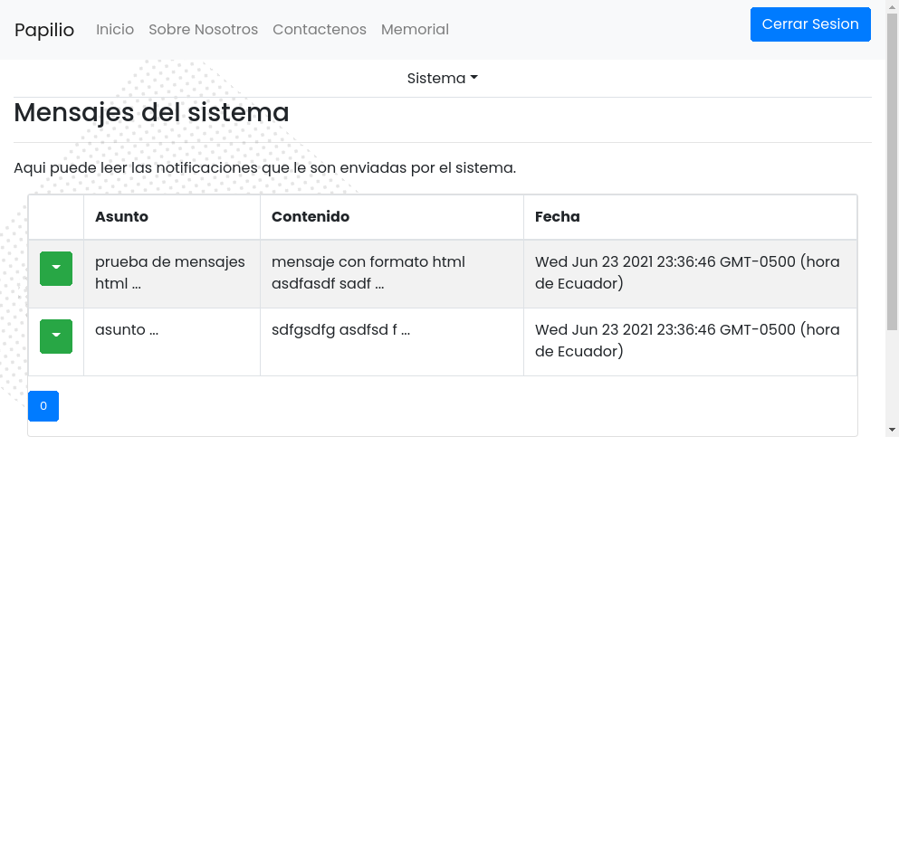

**Tabla de contenidos**
- [Fases del Proyecto](#fases-del-proyecto)
  - [Primera Fase](#primera-fase)
    - [Capturas de pantalla](#capturas-de-pantalla)
  - [Segunda Fase](#segunda-fase)
    - [Capturas de pantalla](#capturas-de-pantalla-1)
  - [Tercera fase: Integración de los servicios de usuario](#tercera-fase-integración-de-los-servicios-de-usuario)
    - [Capturas de pantalla](#capturas-de-pantalla-2)
  - [Cuarta fase: Integración de los servicios de Memorial](#cuarta-fase-integración-de-los-servicios-de-memorial)
    - [Capturas de pantalla](#capturas-de-pantalla-3)
  - [Quinta fase: Funciones pendientes y pruebas](#quinta-fase-funciones-pendientes-y-pruebas)
  - [Sexta fase: Pruebas de usabilidad y accesibilidad](#sexta-fase-pruebas-de-usabilidad-y-accesibilidad)
  - [cuestionarios](#cuestionarios)

# Fases del Proyecto

## Primera Fase

Se desarrolla una aplicación web con las funcionalidades iniciales características de las paginas de la web 2.0, esto es, Landing page, Información de contacto e información de la empresa junto con la creación de la interfaz web para administrarlas mediante ReactJS, obteniendo datos desde la base de datos en Mysql

Como toda aplicación web, dispone de una pagina destinada para el inicio de sesion, para poder utilizarla de forma personalizada según sus respectivos roles de usuario.

La aplicación web utiliza el modelo MVC (modelo vista controlador) con el cual pretende separar las diferentes partes de la lógica de negocios y permitir la escalabilidad a largo plazo

De la misma forma, se separa el BackEnd del FrontEnd, aplicando el modelo MVC a cada uno, reduciendo la posibilidad de brechas de seguridad en caso de ser vulnerado el uno o el otro

### Capturas de pantalla

**Pantalla "Inicio"**

| ruta | rol    |
| ---- | ------ |
| /    | public |
|      |        |

**Vista Escritorio**

**Vista Movil**

**Pantalla "Contacto"**

| ruta      | rol    |
| --------- | ------ |
| /contacto | public |
|           |        |

**Vista Escritorio**

**Vista Móvil**

**Pantalla "Sobre Nosotros"**

| ruta         | rol    |
| ------------ | ------ |
| /quienesomos | public |
|              |        |

**Vista Escritorio**

**Vista Móvil**

**Pantalla "Inicio de Sesion"**

| ruta                  | rol    |
| --------------------- | ------ |
| /Sesion/Inicio_sesion | public |
|                       |        |

**Vista Escritorio**

**Vista Móvil**

## Segunda Fase

La segunda fase implementa la lógica de negocio que caracteriza a esta aplicación web.

Esta fase es predominante para el rol de usuario administrador y consiste en las pantallas de:

- Ver informacion de solicitud de contacto
- Seguridad(admin)
- administracion de perfiles (admin)
- administracion de memorias(admin)

### Capturas de pantalla

**Pantalla "Configuracion del Sistema"**

| ruta | rol   |
| ---- | ----- |
| /    | admin |
|      |       |

**Vista Escritorio**

**Vista Móvil**

**Pantalla "Seguridad"**

| ruta               | rol   |
| ------------------ | ----- |
| /Sistema/seguridad | admin |
|                    |       |

**Vista Escritorio**

**Vista Móvil**

**Pantalla "Configurar envio de E-Mail"**

| ruta                  | rol   |
| --------------------- | ----- |
| /Sistema/confsendmail | admin |
|                       |       |

**Vista Escritorio**

**Vista Móvil**

**Pantalla "Ver solicitudes de informacion"**

| ruta                     | rol   |
| ------------------------ | ----- |
| /Sistema/ver_formularios | admin |
|                          |       |

**Vista Escritorio**

**Vista Móvil**

**Pantalla "Ver solicitudes de informacion"**

| ruta             | rol   |
| ---------------- | ----- |
| /Sistema/cuentas | admin |
|                  |       |

**Vista Escritorio**

**Vista Móvil**

**Pantalla "Cuentas"**

| ruta             | rol   |
| ---------------- | ----- |
| /Sistema/cuentas | admin |
|                  |       |

**Vista Escritorio**

**Vista Móvil**

## Tercera fase: Integración de los servicios de usuario

La tercera fase implementa la interfaz que el usuario utilizara para poder interactuar con los servicios que ofrece la plataforma.
Los elementos que conforman esta fase son: dashboard del usuario, gestión de documentos, gestión de perfiles memoriales, gestión de cuenta personal.
- Perfil inicial para visualizar los mensajes del sistema
- Actualizacion de contraseña
- Actualizacion de Perfil de usuario

### Capturas de pantalla

**Pantalla "Inicio Usuario"**

| ruta | rol  |
| ---- | ---- |
| /    | user |
|      |      |

**Vista Escritorio**

**Vista Móvil**

**Pantalla "Seguridad"**

| ruta               | rol  |
| ------------------ | ---- |
| /Sistema/seguridad | user |
|                    |      |

**Vista Escritorio**

**Vista Móvil**

**Pantalla "Perfil"**

| ruta            | rol  |
| --------------- | ---- |
| /Sistema/perfil | user |
|                 |      |

**Vista Escritorio**

**Vista Móvil**

## Cuarta fase: Integración de los servicios de Memorial

La cuarta fase implementa la administración de la información de los familiares fallecidos, tanto por parte del usuario, como por el administrador.
El administrador podrá crear las entradas respectivas, generando un código QR que se imprimirá en las lapidas correspondiente, mientras que el usuario realizará las respectivas entradas correspondientes a los epitafios, la galería de fotos y eventos fúnebres relacionados
- gestion de los perfiles de memorial(admin)

### Capturas de pantalla

**Pantalla "ver_memorias"**

| ruta                   | rol    |
| ---------------------- | ------ |
| /Memorial/ver_memorias | public |
|                        |        |

**Vista Escritorio**

**Vista Móvil**

**Pantalla "ver_memorias"**

| ruta                   | rol   |
| ---------------------- | ----- |
| /Memorial/ver_memorias | admin |
|                        |       |

**Vista Escritorio**

**Vista Móvil**

**Pantalla "memoria"**

| ruta            | rol    |
| --------------- | ------ |
| /Memorial/:slug | public |
|                 |        |

**Vista Escritorio**

**Vista Móvil**

## Quinta fase: Funciones pendientes y pruebas

En la quinta fase se planificó para realizar las pruebas de accesibilidad y usabilidad, con el fin de corregir los posibles errores que se pudieran encontrar en el proyecto. Por necesidades especificas, se implementaran funciones no esenciales como sistemas de búsqueda, migas de pan, galería y otros, junto con nuevas ideas que han surgido durante el desarrollo.

## Sexta fase: Pruebas de usabilidad y accesibilidad
En la ultima fase, se realizaran diferentes pruebas al sistema con el fin de localizar y corregir los fallos que pueda haber en el. Para ello se preparara un cuestionario para que los usuarios describan sus perspectivas sobre una versión funcional de la aplicación,  ademas del uso de herramientas de software para validar la usabilidad y accesibilidad del sitio web

## cuestionarios
evaluación de accesibilidad
	uso de software como TAW (test de accesibilidad) Achechker y otros
	checklist de cumplimiento de las pautas de WCAG
